# meals

## Using a GridView
 Ekranın üst kısmında bir başlık (AppBar) bulunur. Gövde kısmında ise 2 sütunlu bir grid yer alır.  
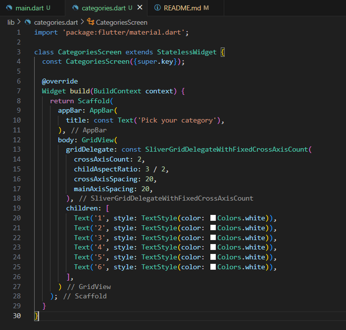 
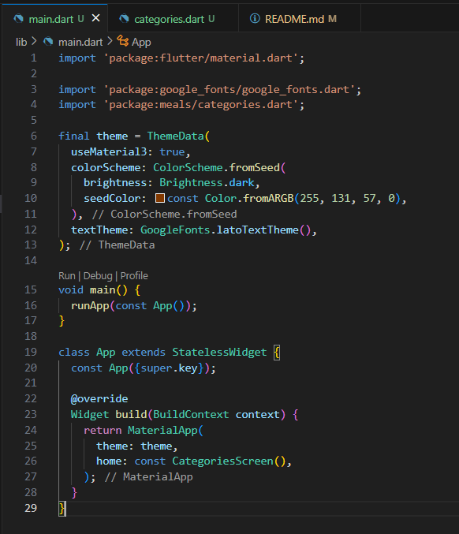   
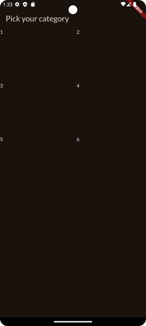 

## Displaying Category Items on a Screen
```CategoriesScreen```, kullanıcıya tüm yemek kategorilerini grid şeklinde listeler.   
```availableCategories``` (```dummy_data.dart``` dosyasında) adlı veri listesindeki her bir kategori için bir kutu (```CategoryGridItem```) oluşturur.
Bu kutular, 2 sütunlu bir grid içinde düzenlenmiştir.   
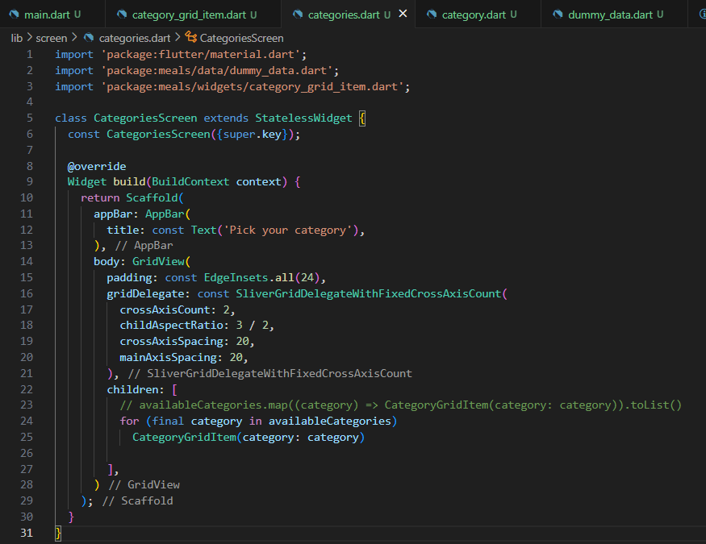  
Her bir kategori için ayrı bir kutu widget’ı tanımlar.  
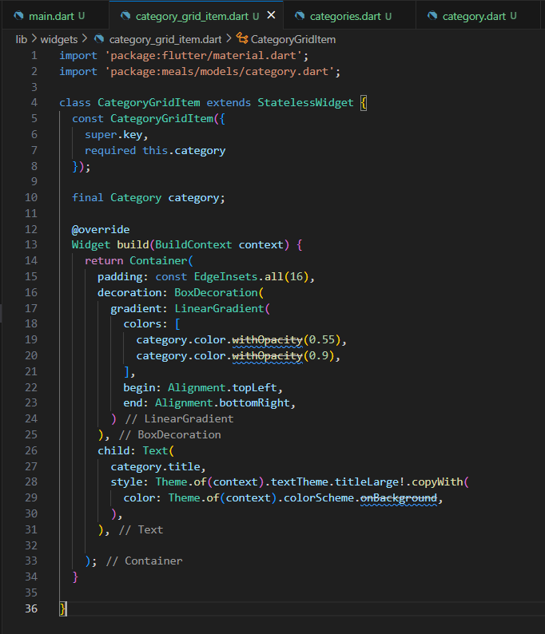   
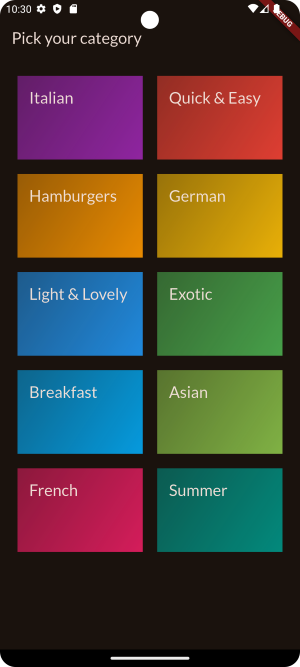 

## Making any Widget Tappable with InkWell
Kategori kutusu artık bir ```InkWell``` widget'ı ile sarmalanmıştır. Bu sayede bir kategoriye tıklandğında etkileşimli bir splash efekti görünecek. 

- ```onTap: () {}``` fonksiyonu şu anda boş bırakılmıştır; ileride farklı sayfalara yönlendirme gibi işlemler yapılacak.
- ```splashColor```, temanın ```primaryColor``` değeri ile belirlenmiştir ve tıklama efektinin rengini tanımlar.
- ```borderRadius``` hem ```InkWell``` hem de ```Container``` içinde tanımlanmıştır.

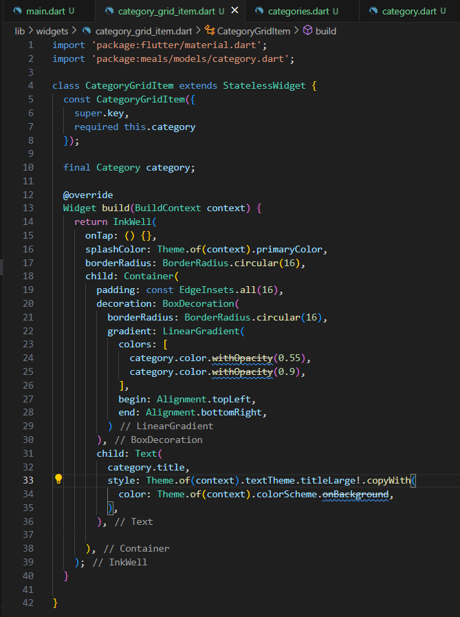    
 

## Loading Meals Data Into a Screen
Bir kategori seçildiğinde, o kategoriye ait yemeklerin listelendiği yeni bir ekran açılır.
Eğer o kategoriye ait hiç yemek yoksa, kullanıcıya bilgi veren boş bir mesaj gösterilir.  

- ```title```: AppBar’da gösterilecek başlık (kategori adı).
- ```meals```: Liste olarak gösterilecek yemekler (Meal tipinde).  

Eğer meals listesi boşsa, kullanıcıya açıklayıcı bir mesaj gösteriliyor.  
Eğer meals listesi boş değilse, yemek başlıklarını ```ListView.builder``` kullanarak dikey liste halinde gösteriyor.  


    
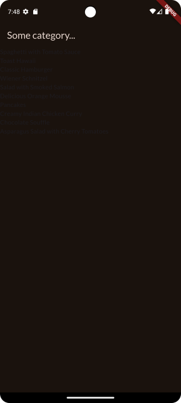 

## Adding Cross-Screen Navigation
Bir kategoriye tıklandığında ilgili sayfaya geçiş özelliği eklendi.  
```CategoriesScreen``` dosyasındaki ```_selectCategory``` metodu sayesinde, kullanıcı bir kategoriye tıkladığında ```MealsScreen``` adlı başka bir sayfaya geçiliyor. (Şimdilik örnek başlık ('Some title') ve boş bir liste (meals: []) gönderiliyor.)  

```CategoryGridItem```'a onTap davranışı eklendi. ```CategoryGridItem``` bileşenine, kategoriye tıklanınca çalışacak ```onSelectCategory``` fonksiyonu gönderildi. Bu fonksiyon, ```_selectCategory``` fonksiyonunu çağırıyor ve yeni sayfaya geçiş yapıyor.  

```CategoryGridItem``` artık dışarıdan bir ```onSelectCategory``` fonksiyonu alıyor. Yani bu kutuya tıklanınca hangi işlem yapılacaksa, bu dışarıdan belirlenebiliyor. Ayrıca InkWell'da onTap ile ilişkilendirildi.  Kullanıcı kategori kutusuna tıkladığında ```onSelectCategory``` fonksiyonu çalıştırılıyor.  

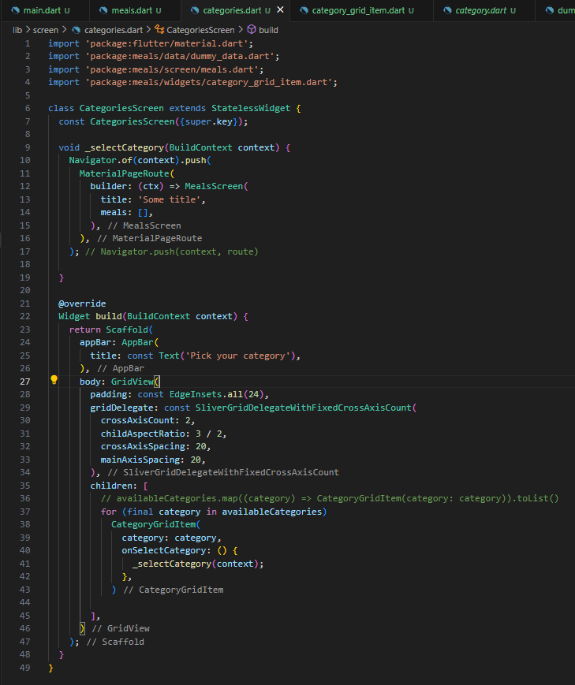
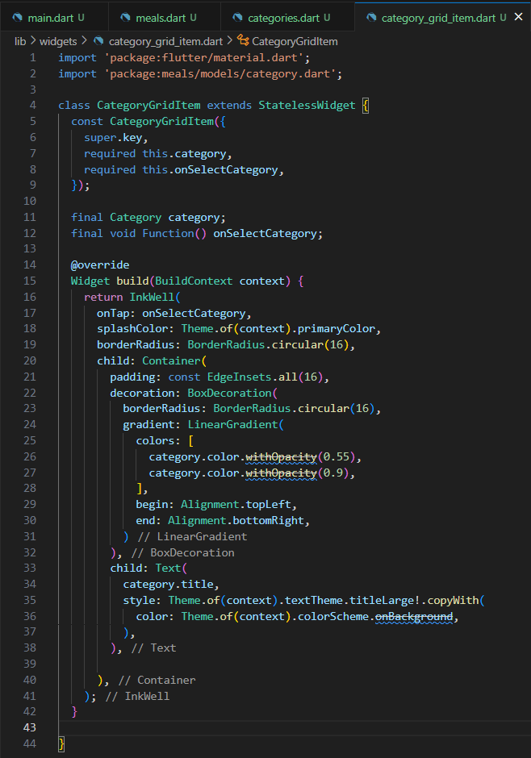   
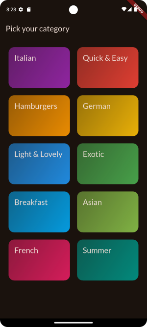
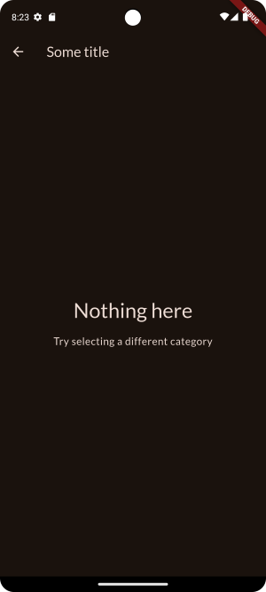   

## Passing Data to the Target Screen
Hangi kategoriye tıklandığı _selectCategory fonksiyonuna iletiliyor. Ayrıca seçilen kategoriye göre filtreleme yapılıyor. dummyMeals listesindeki yemekleri, tıklanan kategoriye göre filtreleniyor. Yani sadece o kategoriye ait yemekler MealsScreen'e gönderiliyor.
Artık bir kategoriye tıklandığında o kategoriye ait yemekler görebiliyoruz ama tabii ki stil ayarları henüz yapılmadı.  
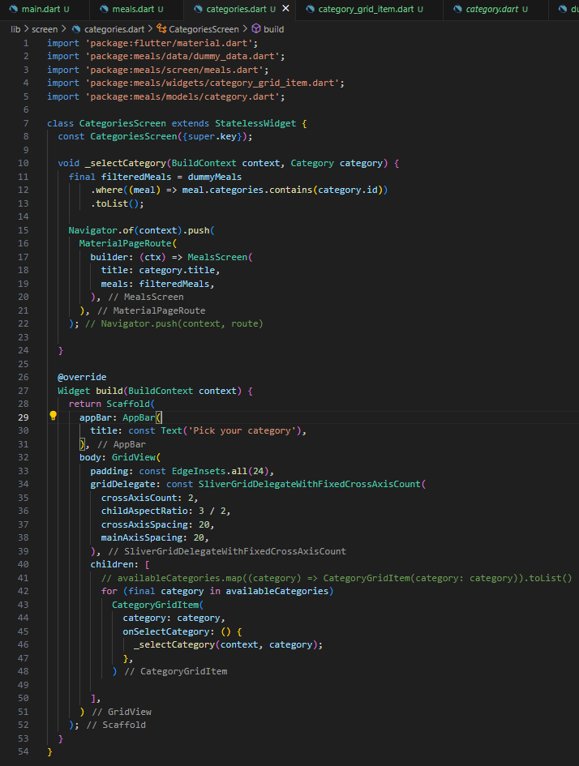   

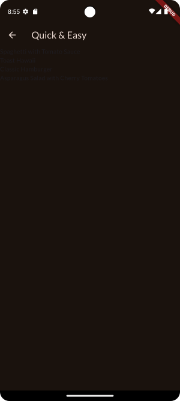
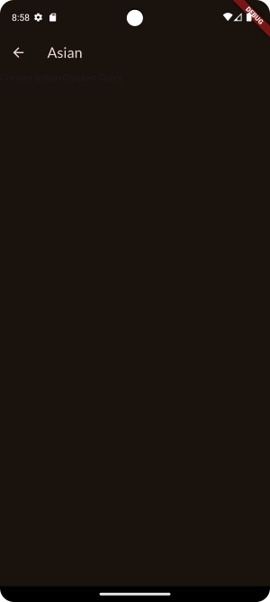

## Introducing the Stack Widget
Artık kategoriye tıklandığında o kategorideki yemekleri görselleriyle birlikte görebiliyoruz.   
```meal_item.dart``` dosyası eklendi ve yemekler için bir card tasarımı oluşturuldu. 
- ```Card widget```: Görsel çerçeveli, gölgeli bir yapı oluşturur.
- ```InkWell``` ile sarılı: Tıklanabilir hale getirilmiş.
- ```FadeInImage```: Görsel yüklenirken geçiş efektiyle görünür.
- ```placeholder``` olarak saydam bir resim (```transparent_image```) kullanılıyor.
- ```Stack``` ve ```Positioned```: Resmin alt kısmına yazı bindirmek için kullanılmış.
- ```Container``` içinde başlık + bilgi alanı: Siyah yarı saydam arka plan üzerinde başlık gösteriliyor.

```MealsScreen``` sınıfında da artık her yemek sadece başlık olarak Text değil, bir ```MealItem``` kartıyla gösteriliyor.

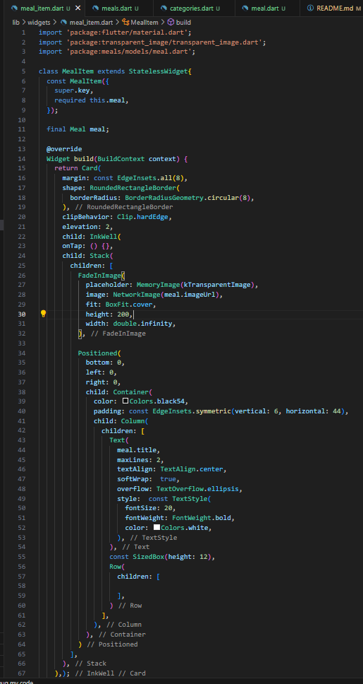
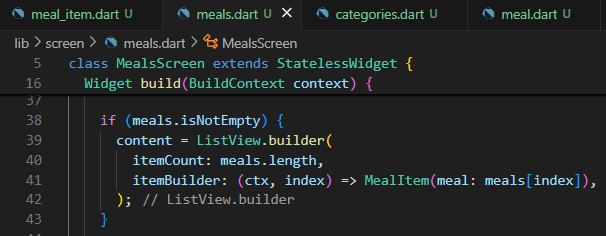   
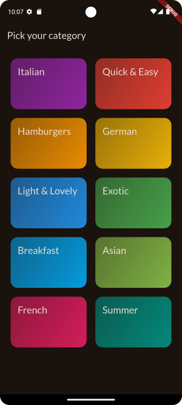
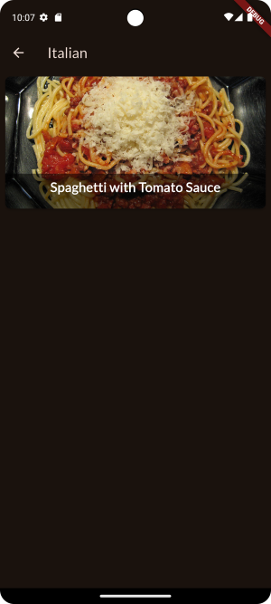
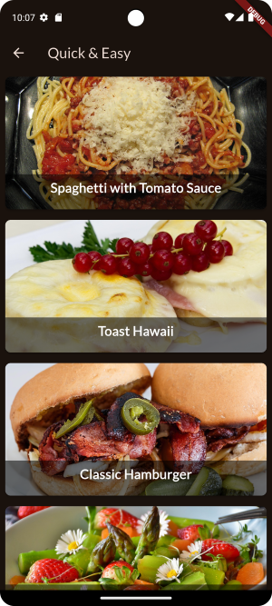

## Improving the MealItem Widget

```MealItemTrait``` adında yeni bir widget eklendi. Tekrarlanan "ikon + yazı" yapısı küçük, yeniden kullanılabilir bir widget’a dönüştürüldü.  
```MealItem```'da da Yemek kartlarının alt kısmına, yemeğe dair ek bilgiler (süre, zorluk, maliyet) eklendi.   

   
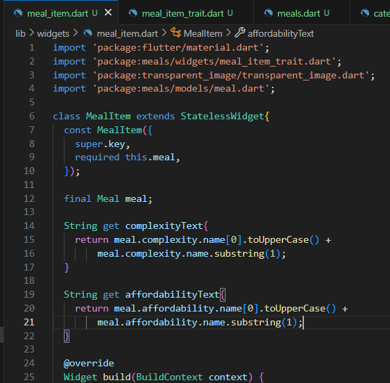
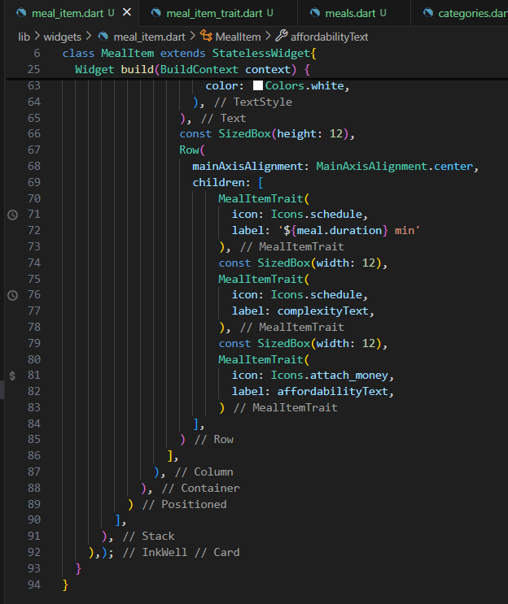    
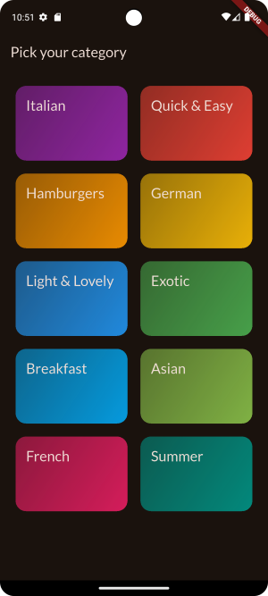


## Adding Navigation to the MealDetails Screen
MealDetailsScreen oluşturuldu bu sayede bir yemeğe tıklandığında detaylarına yönlendirilebilecek.   
| **Adım** | **Ne Oluyor?**                                                                                                                                                                                                          |
| -------- | ----------------------------------------------------------------------------------------------------------------------------------------------------------------------------------------------------------------------- |
| **1.**   | Kullanıcı, ekranda listelenen yemeklerden birinin **kartına (MealItem)** tıklar. Bu kartın içinde bir `InkWell` vardır ve `onTap` özelliği ayarlanmıştır.                                                               |
| **2.**   | Kartın `onTap`'i tetiklenince, `MealItem` widget'ına dışarıdan parametre olarak gelen **`onSelectMeal(meal)`** fonksiyonu çağrılır. Bu fonksiyona, tıklanan yemeği temsil eden `meal` nesnesi parametre olarak verilir. |
| **3.**   | `onSelectMeal` fonksiyonu, aslında `MealsScreen` içinde tanımlanmıştır ve içinde `Navigator.of(context).push(...)` kodu vardır. Bu sayede **yeni bir ekran (MealDetailsScreen)** açılır.                                |
| **4.**   | Açılan detay ekranına (`MealDetailsScreen`) **tıklanan yemek (`meal`) bilgisi gönderilir**. 

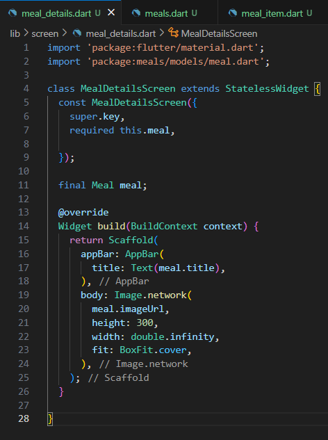  
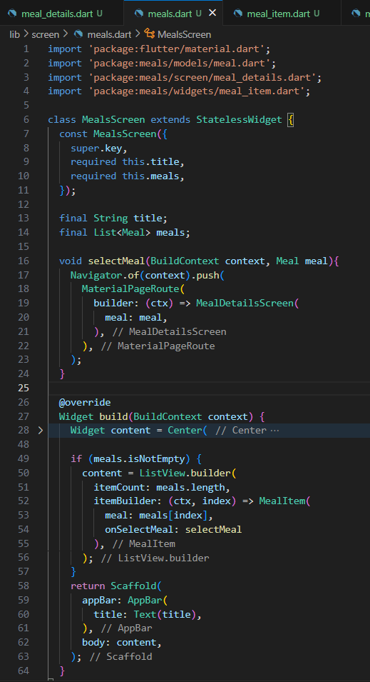
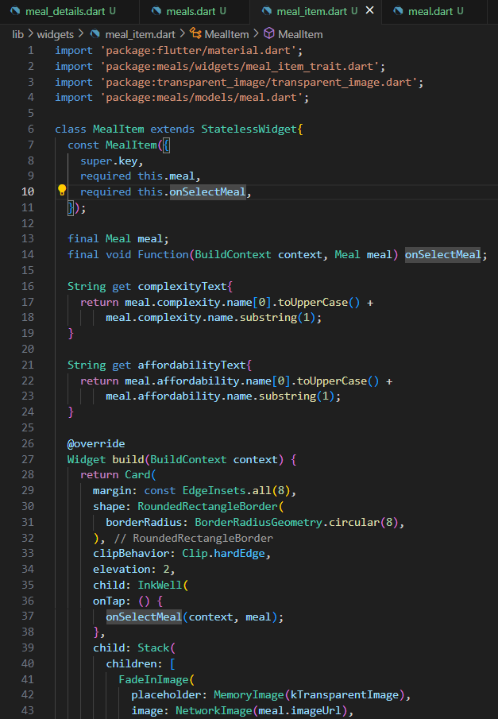    

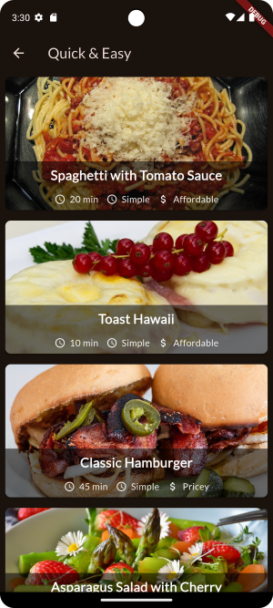
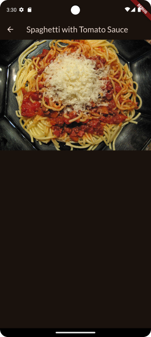

## Improving the MealDetails Screen

- `SingleChildScrollView` eklendi. Bu sayede içerik ekran boyutunu aşarsa, kullanıcı sayfayı kaydırabilir.                    
- `meal.ingredients` listesindeki her bir madde `Text` olarak ekranda gösteriliyor.                                       
- `meal.steps` listesindeki her bir pişirme adımı yine `Text` ve `Padding` ile listeleniyor.                     
- `Image.network` özelliği genişlik ve yükseklik ile düzenlenmiş, `BoxFit.cover` sayesinde görsel düzgün şekilde kırpılıyor.                                     

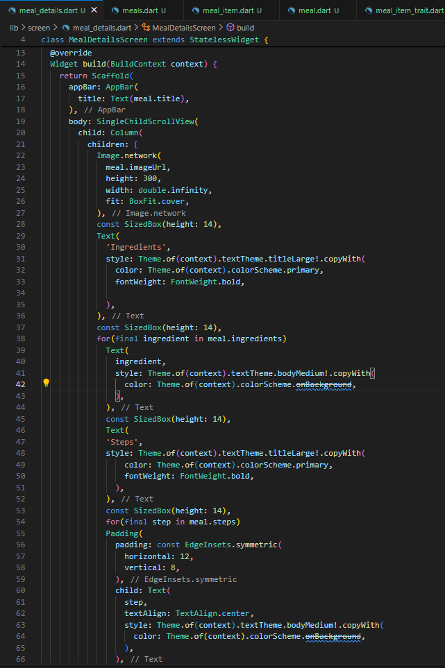    


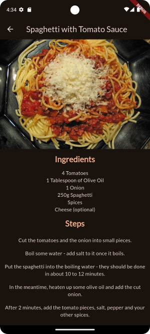

## Adding Tab-based Navigation
TabsScreen eklendi: 
- Altta iki sekmeli bir gezinme çubuğu eklendi: **Categories** ve **Favorites**                                  
- Kullanıcının hangi sekmede olduğunu takip etmek için `_selectedPageIndex` değişkeni ve `setState` kullanıldı. 
- `CategoriesScreen` ve `MealsScreen` arasında geçiş yapılabiliyor.                                              
- AppBar başlığı seçilen sekmeye göre değişiyor.                                                                 

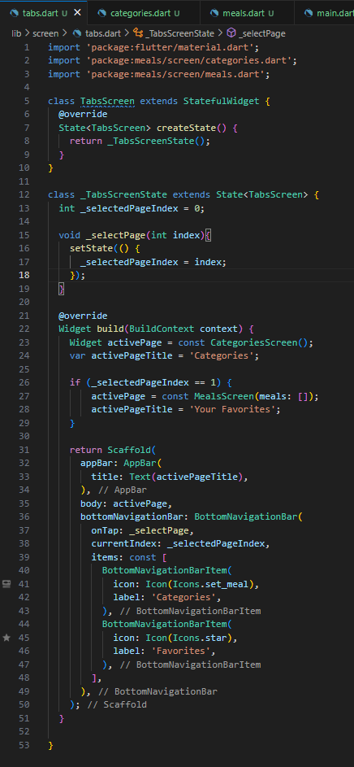
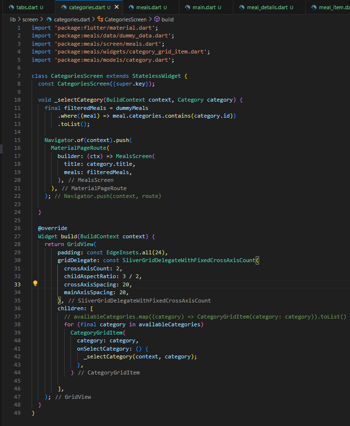
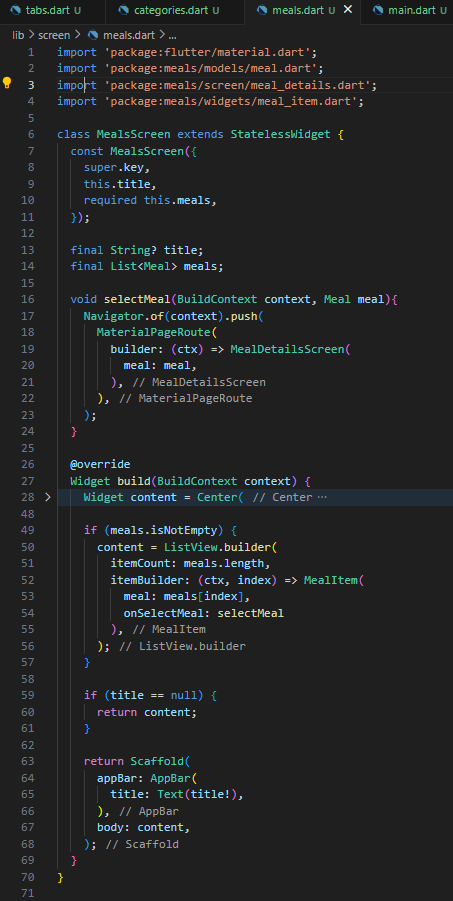  
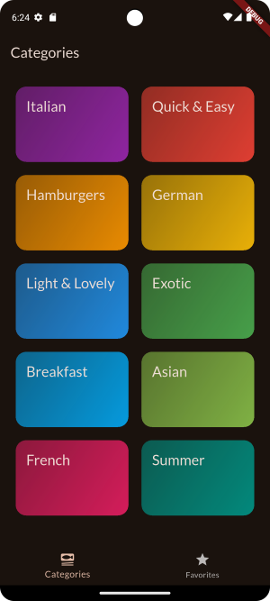

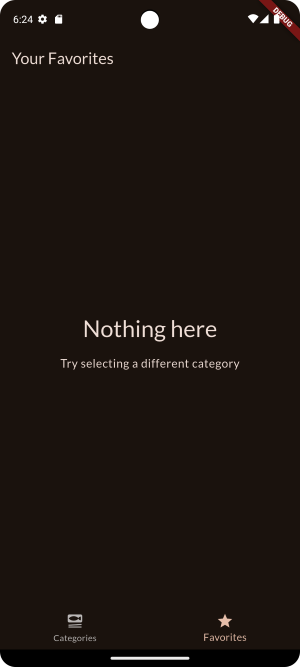


## Passing Functions Through Multiple Layers of Widgets (for State Management)
Kullanıcı bir yemeğin detay ekranında star ikonuna tıklayarak favorilere ekleyebiliyor veya çıkarabiliyor.

- `_toggleMealFavoriteStatus(Meal meal)`:  Favori ekleme/çıkarma işlemini yönetiyor.                     
- `_showInfoMessage(String message)`:     Kullanıcıya işlem sonucu mesaj gösteriyor.                    |
- `_favoriteMeals`:                        Favorilere eklenen yemeklerin tutulduğu liste (state içinde). |

`onToggleFavorite` fonksiyonu: `TabsScreen`'den → `CategoriesScreen` → `MealsScreen` → `MealDetailsScreen` bileşenlerine parametre olarak geçiriliyor. Böylece her ekrandan favori işlemi tetiklenebilir hale geldi.

- `CategoriesScreen`:   Kategoriye tıklanınca `MealsScreen`'e `onToggleFavorite` da gönderiliyor.         
- `MealsScreen`:        Liste elemanına tıklanınca `MealDetailsScreen`'e `onToggleFavorite` gönderiliyor. 
- `MealDetailsScreen`:  AppBar'daki yıldız ikonuna tıklanınca favori durumu değiştiriliyor.               

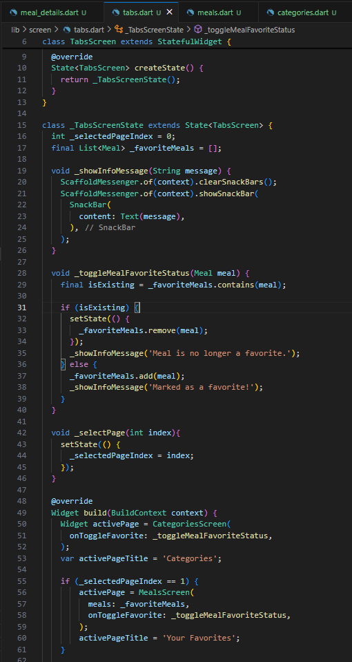     
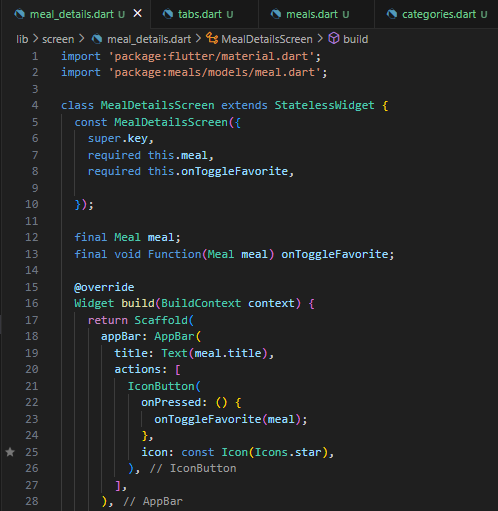

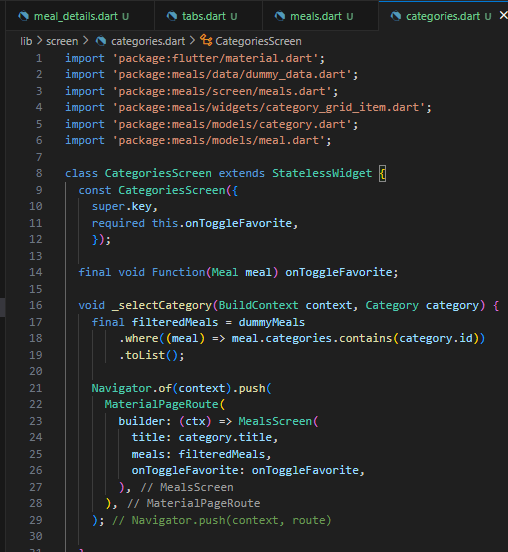    
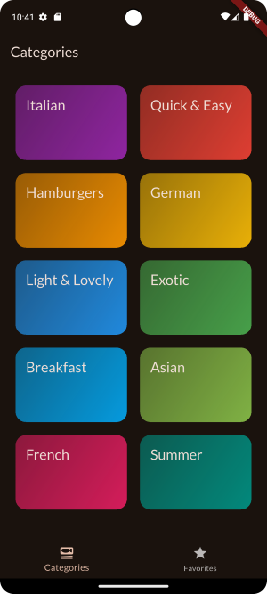
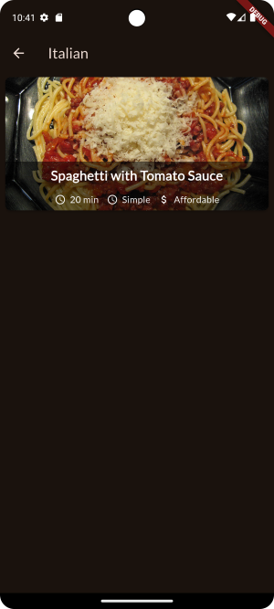
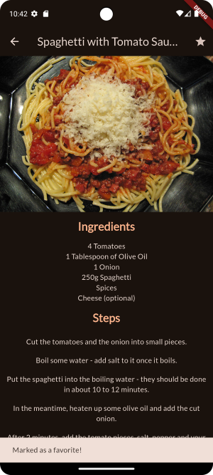
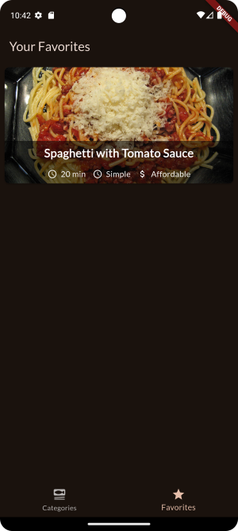


## Adding a Side Drawer
MainDrawer widget’ı ile uygulamaya yan menü (Drawer) işlevi kazandırıldı.


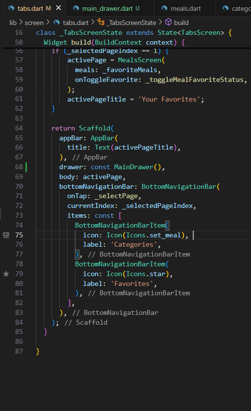

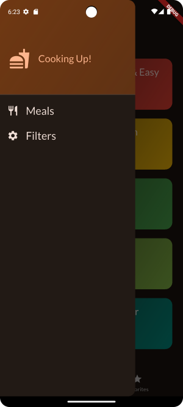

## Closing the Drawer Manually
Yan menüde açılan meals kategorisine tıklandığında yan menü kapanıyor.

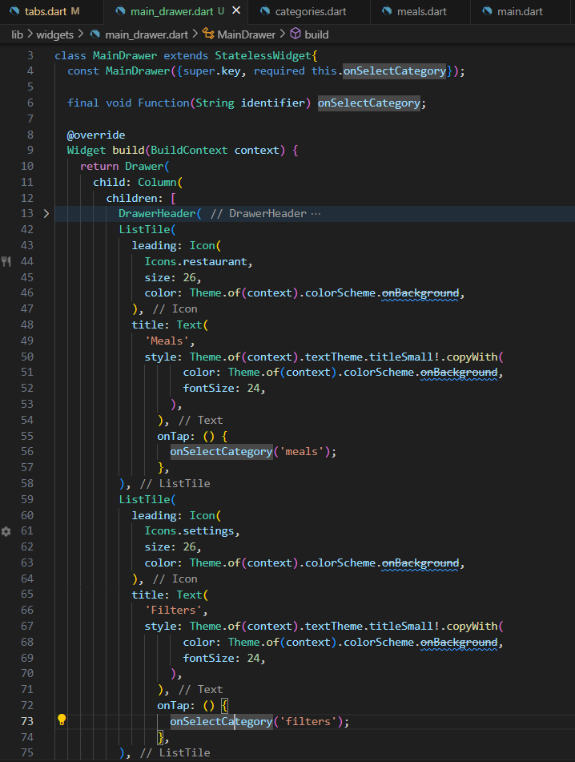
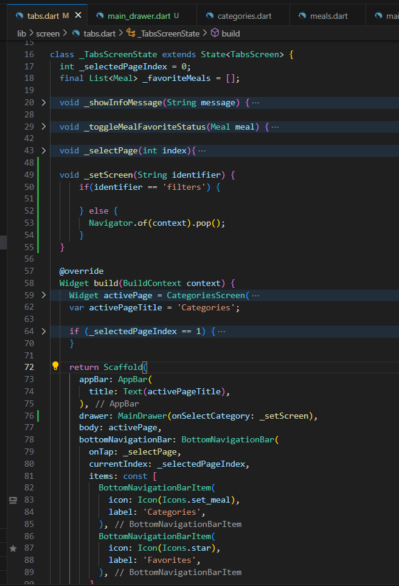

## Adding a Filter Item
`FiltersScreen` adında yeni bir ekran oluşturuldu. Bu ekran sayesinde kullanıcılar kendi tercihlerine göre yemekleri filtreleyebilecek. Şu an sadece gluten-free filtresi eklendi.

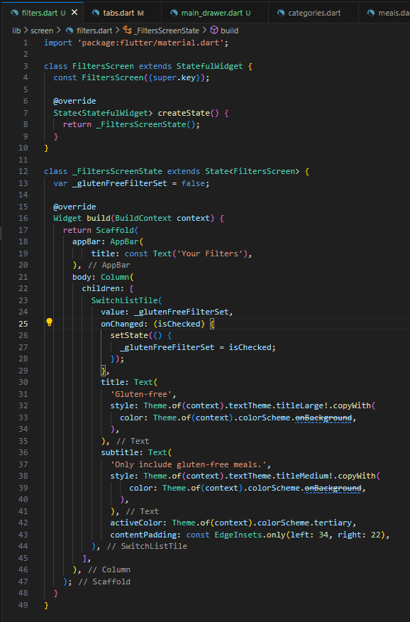

## Replacing Screens (Instead of Pushing)
MainDrawer içinde bir onSelectCategory fonksiyonu hangi menü seçildiğini yukarıya (Scaffold’a) bildiriyor. "meals" seçildiğinde TabsScreen’e dönüyor.

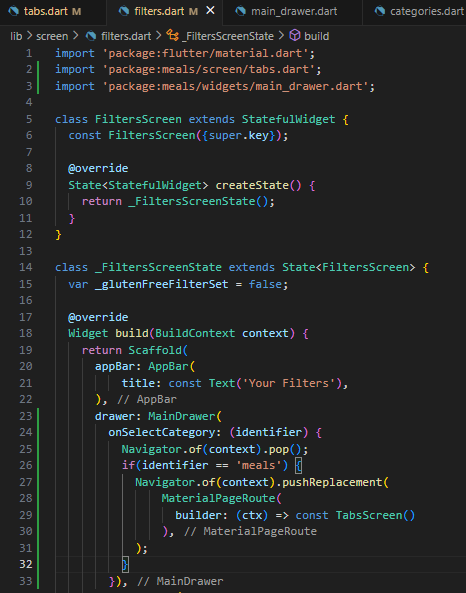
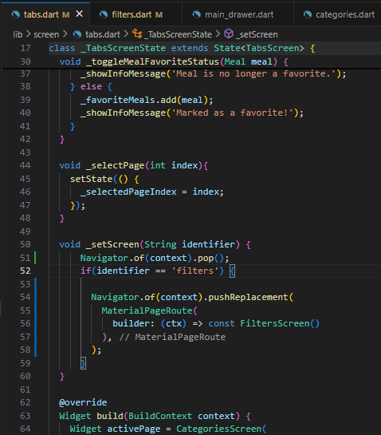   
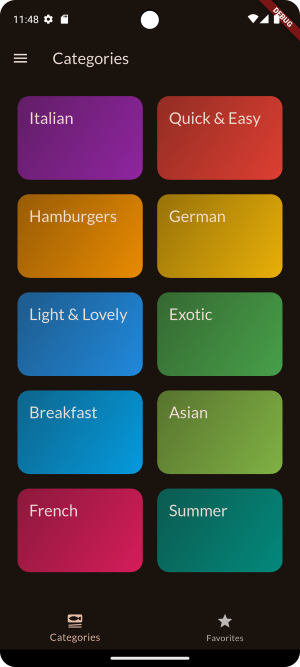

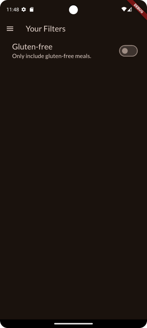

## Returning Data When Leaving a Screen
WillPopScope, kullanıcı geri tuşuna bastığında özel bir işlem yapmasını sağlıyor. Normalde geri tuşuna basınca direkt sayfa kapanıyordu ama burada filtre bilgileri bir Map olarak geri gönderiliyor.

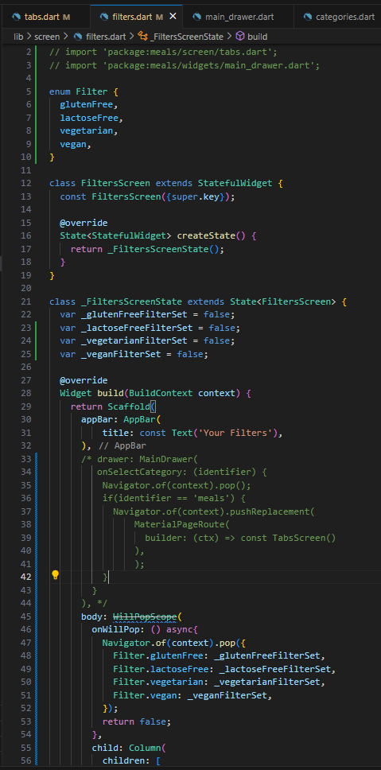


## Reading & Using Returned Data
TabsScreen’e filtre ekranını Drawer’dan açma ve oradan seçilen filtre ayarlarını (Map<Filter, bool>) geri alma özelliği eklendi.
Şu an bu veriler sadece print ile konsola yazdırılıyor, ileride yemek listelerini filtrelemek için kullanılabilecek.

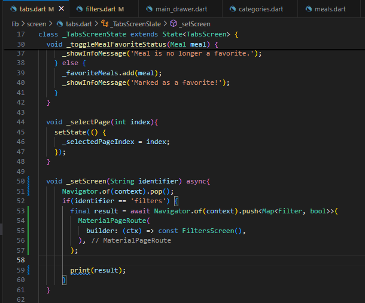

## Applying Filters
Filtreleme özelliği eklendi. kInitialFilters ile başlangıç filtre değerleri tanımlandı (glutenFree, lactoseFree, vegetarian, vegan).
Seçilen filtreler Map<Filter, bool> _selectedFilters içinde tutuluyor.   

Drawer’dan "filters" seçildiğinde FiltersScreen açılıyor ve mevcut filtre değerleri gönderiliyor (currentFilters).
Kullanıcı geri döndüğünde seçilen filtreler Navigator.pop ile TabsScreen’e geri geliyor ve _selectedFilters güncelleniyor.   

availableMeals listesi, _selectedFilters’e göre dummyMeals üzerinden filtreleniyor.
Böylece CategoriesScreen’e sadece seçilen filtrelere uygun yemekler gönderiliyor.    

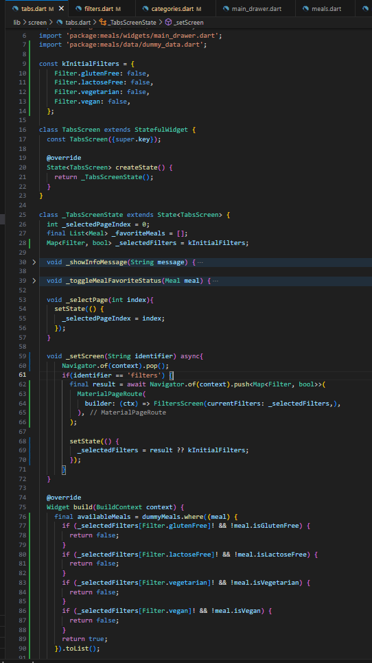
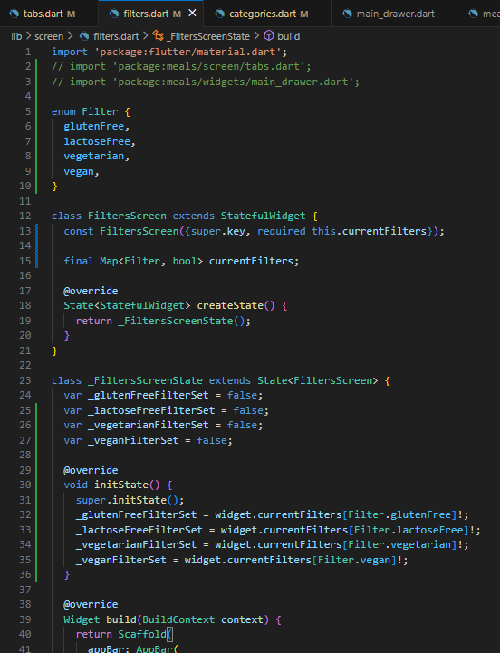
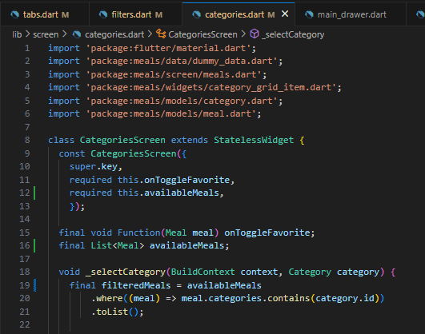    
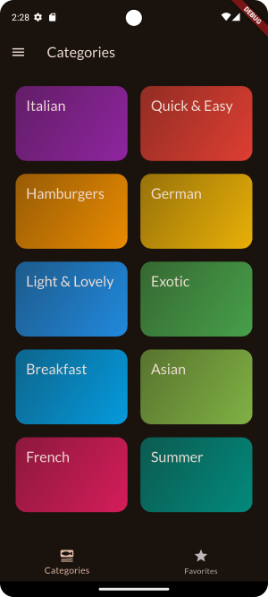
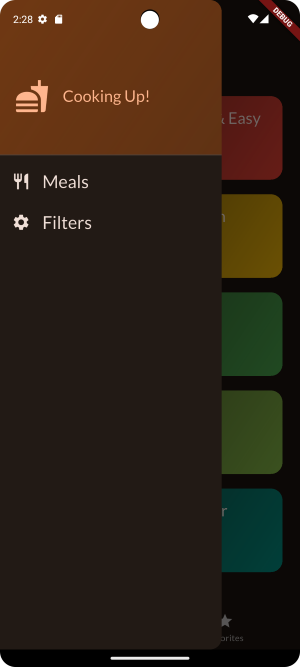
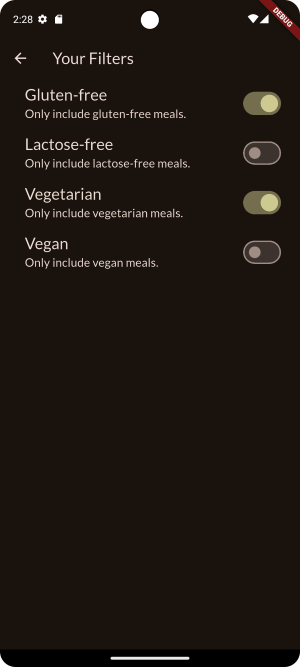
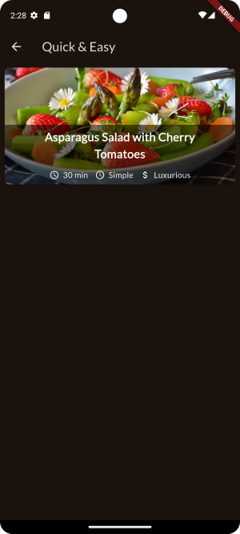

## Installing the Solution: Riverpod

```
flutter pub add flutter_riverpod
```

Terminalde bu komutu çalıştırarak projeye Riverpod bir extention olarak eklenir.

dummyMeals listesi Riverpod ile Provider içine koyuldu. Bu sayede bu listeye ihtiyaç duyulan her yerden `ref.watch(mealsProvider)` ile erişebilir.  

`TabsScreen` artık `ConsumerStatefulWidget` oldu. Böylece `ref.watch()` kullanarak provider’lardaki veriyi dinleyebiliyorsun. (provider’ın döndürdüğü veri ileride değişirse, bu widget da otomatik olarak yeniden build olur ve yeni veriyi gösterir.)

```dart
final meals = ref.watch(mealsProvider);
```

Önceden doğrudan `dummyMeals` kullanılıyordu. Artık Riverpod provider’dan veriyi okuyor.

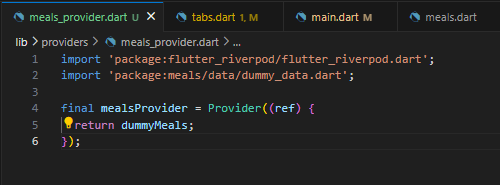   
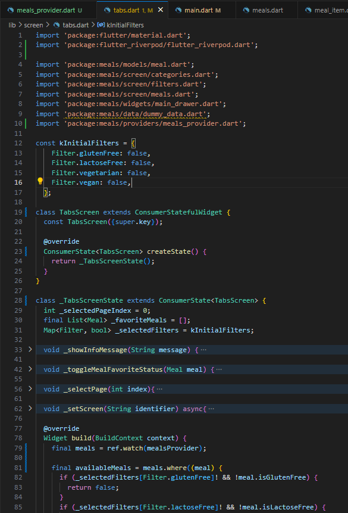
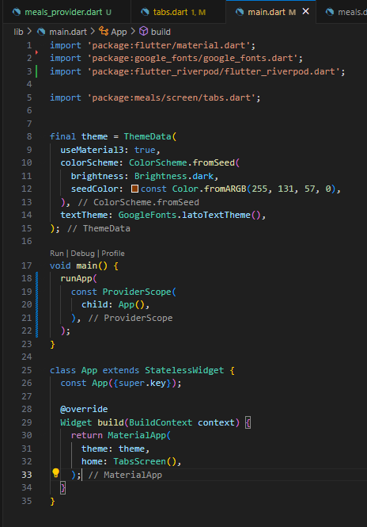

## Creating a More Complex Provider with StateNotifier

Riverpod + StateNotifier kullanarak “favori yemekler” listesinin yönetimini tek bir yerde toplanaccak.


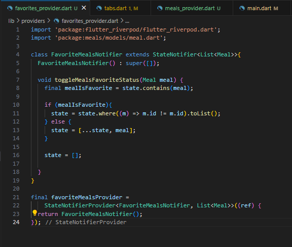


## Triggering a Notifier Method

`favorites_provider.dart`:   
Riverpod’un `StateNotifier` sınıfını kullanarak favori yemeklerin listesi tutuluyor.

`toggleMealsFavoriteStatus` fonksiyonu ile yemek listede varsa çıkarır yoksa ekler.


```dart
import 'package:flutter_riverpod/flutter_riverpod.dart';
import 'package:meals/models/meal.dart';

class FavoriteMealsNotifier extends StateNotifier<List<Meal>>{
  FavoriteMealsNotifier() : super([]);

  bool toggleMealsFavoriteStatus(Meal meal) {
    final mealIsFavorite = state.contains(meal);
    
    if (mealIsFavorite){
      state = state.where((m) => m.id != m.id).toList();
      return false;
    } else {
      state = [...state, meal];
      return true;
    }
    
    state = [];

  }
}

final favoriteMealsProvider = 
    StateNotifierProvider<FavoriteMealsNotifier, List<Meal>>((ref) {
  return FavoriteMealsNotifier();
});
```


`tabs.dart`:   
`ConsumerStatefulWidget` ve `WidgetRef` kullanarak Riverpod entegrasyonu yapıldı.

`ref.watch(mealsProvider)` → Tüm yemekleri Riverpod’dan çekiyor.

`ref.watch(favoriteMealsProvider)` → Favori yemekleri Riverpod’dan çekiyor (eski _favoriteMeals listesi kaldırıldı).

```dart
import 'package:flutter/material.dart';
import 'package:flutter_riverpod/flutter_riverpod.dart';

import 'package:meals/models/meal.dart';
import 'package:meals/screen/categories.dart';
import 'package:meals/screen/filters.dart';
import 'package:meals/screen/meals.dart';
import 'package:meals/widgets/main_drawer.dart';
import 'package:meals/providers/meals_provider.dart';
import 'package:meals/providers/favorites_provider.dart';

const kInitialFilters = {
    Filter.glutenFree: false,
    Filter.lactoseFree: false,
    Filter.vegetarian: false,
    Filter.vegan: false,
  };

class TabsScreen extends ConsumerStatefulWidget {
  const TabsScreen({super.key});

  @override
  ConsumerState<TabsScreen> createState() {
    return _TabsScreenState();
  }
}

class _TabsScreenState extends ConsumerState<TabsScreen> {
  int _selectedPageIndex = 0;
  Map<Filter, bool> _selectedFilters = kInitialFilters;


  void _selectPage(int index){
    setState(() {
      _selectedPageIndex = index;
    });
  }

  void _setScreen(String identifier) async{
      Navigator.of(context).pop();
      if(identifier == 'filters') {
        final result = await Navigator.of(context).push<Map<Filter, bool>>(
          MaterialPageRoute(
            builder: (ctx) => FiltersScreen(currentFilters: _selectedFilters,),
          ),
        );

        setState(() {
          _selectedFilters = result ?? kInitialFilters;
        });
      }
  }

  @override
  Widget build(BuildContext context) {
    final meals = ref.watch(mealsProvider);

    final availableMeals = meals.where((meal) {
      if (_selectedFilters[Filter.glutenFree]! && !meal.isGlutenFree) {
        return false;
      }
      if (_selectedFilters[Filter.lactoseFree]! && !meal.isLactoseFree) {
        return false;
      }
      if (_selectedFilters[Filter.vegetarian]! && !meal.isVegetarian) {
        return false;
      }
      if (_selectedFilters[Filter.vegan]! && !meal.isVegan) {
        return false;
      }
      return true;
    }).toList();

    Widget activePage = CategoriesScreen(
      availableMeals: availableMeals,
    );
    var activePageTitle = 'Categories';

    if (_selectedPageIndex == 1) {
        final favoriteMeals = ref.watch(favoriteMealsProvider);
        activePage = MealsScreen(
          meals: favoriteMeals, 
        );
        activePageTitle = 'Your Favorites';
    }

    return Scaffold(
      appBar: AppBar(
        title: Text(activePageTitle),
      ),
      drawer: MainDrawer(onSelectCategory: _setScreen),
      body: activePage,
      bottomNavigationBar: BottomNavigationBar(
        onTap: _selectPage,
        currentIndex: _selectedPageIndex,
        items: const [
          BottomNavigationBarItem(
            icon: Icon(Icons.set_meal), 
            label: 'Categories', 
          ),
          BottomNavigationBarItem(
            icon: Icon(Icons.star), 
            label: 'Favorites', 
          ),
        ],
      ),
    );
  }

}

```

`meals.dart`:  
`onToggleFavorite` parametresi kaldırıldı çünkü artık favori işlemi MealDetailsScreen içinde Riverpod ile yapılıyor.

```dart
import 'package:flutter/material.dart';
import 'package:meals/models/meal.dart';
import 'package:meals/screen/meal_details.dart';
import 'package:meals/widgets/meal_item.dart';

class MealsScreen extends StatelessWidget {
  const MealsScreen({
    super.key,
    this.title,
    required this.meals,
  });

  final String? title;
  final List<Meal> meals;

  void selectMeal(BuildContext context, Meal meal){
    Navigator.of(context).push(
      MaterialPageRoute(
        builder: (ctx) => MealDetailsScreen(
          meal: meal,
        ),
      ),
    );
  }

  @override
  Widget build(BuildContext context) {
    Widget content = Center(
      child: Column(
        mainAxisSize: MainAxisSize.min,
        children: [
          Text(
            'Nothing here',
            style: Theme.of(context).textTheme.headlineLarge!.copyWith(
                  color: Theme.of(context).colorScheme.onBackground,
                ),
          ),
          const SizedBox(height: 16),
          Text(
            'Try selecting a different category',
            style: Theme.of(context).textTheme.bodyLarge!.copyWith(
                  color: Theme.of(context).colorScheme.onBackground,
                ),
          ),
        ],
      ),
    );

    if (meals.isNotEmpty) {
      content = ListView.builder(
        itemCount: meals.length,
        itemBuilder: (ctx, index) => MealItem(
          meal: meals[index], 
          onSelectMeal: selectMeal
        ),
      );
    }

    if (title == null) {
      return content;
    }

    return Scaffold(
      appBar: AppBar(
        title: Text(title!),
      ),
      body: content,
    );
  }
}

```

`meal_details.dart`:  
ConsumerWidget haline getirildi.

ref.read(favoriteMealsProvider.notifier).toggleMealsFavoriteStatus(meal) ile favori durumu değiştiriliyor.

İşlem sonrası SnackBar ile kullanıcıya ekleme/çıkarma bilgisi veriliyor.
```dart
import 'package:flutter/material.dart';
import 'package:flutter_riverpod/flutter_riverpod.dart';
import 'package:meals/models/meal.dart';
import 'package:meals/providers/favorites_provider.dart';

class MealDetailsScreen extends ConsumerWidget {
  const MealDetailsScreen({
    super.key,
    required this.meal,

  });

  final Meal meal;

  @override
  Widget build(BuildContext context, WidgetRef ref) {
    return Scaffold(
      appBar: AppBar(
        title: Text(meal.title),
        actions: [
          IconButton(
            onPressed: () {
              final wasAdded = ref
                .read(favoriteMealsProvider.notifier)
                .toggleMealsFavoriteStatus(meal);
              ScaffoldMessenger.of(context).clearSnackBars();
              ScaffoldMessenger.of(context).showSnackBar(
                SnackBar(
                  content: Text(
                    wasAdded ? 'Meal added as a favorite.' : 'Meal removed.'
                  ),
                ),
              );
            }, 
            icon: const Icon(Icons.star),
          ),
        ],
      ),
      body: SingleChildScrollView(
        child: Column(
          children: [
            Image.network(
              meal.imageUrl,
              height: 300,
              width: double.infinity,
              fit: BoxFit.cover,
            ),
            const SizedBox(height: 14),
            Text(
              'Ingredients',
              style: Theme.of(context).textTheme.titleLarge!.copyWith(
                color: Theme.of(context).colorScheme.primary,
                fontWeight: FontWeight.bold,
        
              ),
            ),
            const SizedBox(height: 14),
            for(final ingredient in meal.ingredients)
              Text(
                ingredient,
                style: Theme.of(context).textTheme.bodyMedium!.copyWith(
                  color: Theme.of(context).colorScheme.onBackground,
                ),
              ),
              const SizedBox(height: 14),
              Text(
              'Steps',
              style: Theme.of(context).textTheme.titleLarge!.copyWith(
                  color: Theme.of(context).colorScheme.primary,
                  fontWeight: FontWeight.bold,
                ),
              ),
              const SizedBox(height: 14),
              for(final step in meal.steps)
              Padding(
                padding: const EdgeInsets.symmetric(
                  horizontal: 12, 
                  vertical: 8,
                ),
                child: Text(
                  step,
                  textAlign: TextAlign.center,
                  style: Theme.of(context).textTheme.bodyMedium!.copyWith(
                    color: Theme.of(context).colorScheme.onBackground,
                  ),
                ),
              ),
          ],
        ),
      ),
    );
  }

}

```


## Filter Provider
filters_provider.dart → Filtrelerin merkezi yönetimi için provider tanımlandı.  

ConsumerStatefulWidget veya ConsumerWidget kullanmak, bir widget’ın Riverpod sağlayıcılarını (provider) dinleyebilmesini sağlar.
Bu sayede:

Widget, ref adında özel bir nesneye erişir.

ref.watch(provider), provider’daki veriyi izler. Provider’da veri değiştiğinde, widget kendiliğinden yeniden çizilir (build edilir).

ref.read(provider.notifier), provider’ın mantığını çalıştırmak, yani veriyi değiştirmek için kullanılır.

Bu yöntemle, veriler provider’dan gelir ve değişiklikler otomatik olarak UI’a yansır.
Böylece manuel olarak setState() kullanmaya gerek kalmaz, çünkü state yönetimi tamamen provider tarafından yapılır.

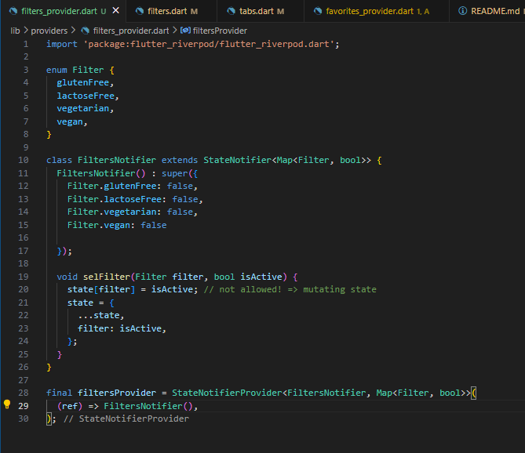
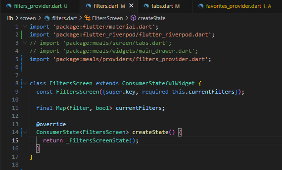

## Outsourcing State Into The Provider
`filters.dart`:   
Önceden filtre değerleri widget içinde `StatefulWidget` ile tutuluyor ve `initState()` ile provider’dan ilk değer alınıyordu. Sayfa kapanırken `WillPopScope` ile tüm filtreler tek seferde provider’a kaydediliyordu.

Şimdş ise filtrelerin tamamı direkt provider’dan `ref.watch()` ile okunuyor ve değişiklikler `onChanged` içinde anında `ref.read(...).setFilter(...)` ile kaydediliyor. Böylece:

Yerel `state` ve `initState()` tamamen kaldırıldı.

`setState()` yerine provider güncellemesi yapılıyor.

`WillPopScope` ile toplu kaydetme yerine anlık güncelleme yapılıyor.


```dart
import 'package:flutter/material.dart';
import 'package:flutter_riverpod/flutter_riverpod.dart';
// import 'package:meals/screen/tabs.dart';
// import 'package:meals/widgets/main_drawer.dart';
import 'package:meals/providers/filters_provider.dart';


class FiltersScreen extends ConsumerWidget {
  const FiltersScreen({super.key});


  @override
  Widget build(BuildContext context, WidgetRef ref) {
    final activeFilters = ref.watch(filtersProvider);

    return Scaffold(
      appBar: AppBar(
          title: const Text('Your Filters'),
      ),
        body: Column(
          children: [
            SwitchListTile(
              value: activeFilters[Filter.glutenFree]!, 
              onChanged: (isChecked) {
                ref
                    .read(filtersProvider.notifier)
                    .setFilter(Filter.glutenFree, isChecked);
              }, 
              title: Text(
                'Gluten-free',
                style: Theme.of(context).textTheme.titleLarge!.copyWith(
                  color: Theme.of(context).colorScheme.onBackground,
                ),
              ),
              subtitle: Text(
                'Only include gluten-free meals.',
                style: Theme.of(context).textTheme.titleMedium!.copyWith(
                    color: Theme.of(context).colorScheme.onBackground,
                  ),
                ),
                activeColor: Theme.of(context).colorScheme.tertiary,
                contentPadding: const EdgeInsets.only(left: 34, right: 22),
            ),
            SwitchListTile(
              value: activeFilters[Filter.lactoseFree]!, 
              onChanged: (isChecked) {
                ref
                    .read(filtersProvider.notifier)
                    .setFilter(Filter.lactoseFree, isChecked);
              }, 
              title: Text(
                'Lactose-free',
                style: Theme.of(context).textTheme.titleLarge!.copyWith(
                  color: Theme.of(context).colorScheme.onBackground,
                ),
              ),
              subtitle: Text(
                'Only include lactose-free meals.',
                style: Theme.of(context).textTheme.titleMedium!.copyWith(
                    color: Theme.of(context).colorScheme.onBackground,
                  ),
                ),
                activeColor: Theme.of(context).colorScheme.tertiary,
                contentPadding: const EdgeInsets.only(left: 34, right: 22),
            ),
            SwitchListTile(
              value: activeFilters[Filter.vegetarian]!, 
              onChanged: (isChecked) {
                ref
                    .read(filtersProvider.notifier)
                    .setFilter(Filter.vegetarian, isChecked);
              },  
              title: Text(
                'Vegetarian',
                style: Theme.of(context).textTheme.titleLarge!.copyWith(
                  color: Theme.of(context).colorScheme.onBackground,
                ),
              ),
              subtitle: Text(
                'Only include vegetarian meals.',
                style: Theme.of(context).textTheme.titleMedium!.copyWith(
                    color: Theme.of(context).colorScheme.onBackground,
                  ),
                ),
                activeColor: Theme.of(context).colorScheme.tertiary,
                contentPadding: const EdgeInsets.only(left: 34, right: 22),
            ),
            SwitchListTile(
              value: activeFilters[Filter.vegan]!, 
              onChanged: (isChecked) {
                ref
                    .read(filtersProvider.notifier)
                    .setFilter(Filter.vegan, isChecked);
              }, 
              title: Text(
                'Vegan',
                style: Theme.of(context).textTheme.titleLarge!.copyWith(
                  color: Theme.of(context).colorScheme.onBackground,
                ),
              ),
              subtitle: Text(
                'Only include vegan meals.',
                style: Theme.of(context).textTheme.titleMedium!.copyWith(
                    color: Theme.of(context).colorScheme.onBackground,
                  ),
                ),
                activeColor: Theme.of(context).colorScheme.tertiary,
                contentPadding: const EdgeInsets.only(left: 34, right: 22),
            ),
          ],
      ),
    );
  }
}
```

## Connecting Multiple Providers With Each Other (Dependent Providers)

`filter_provider.dart`:  
filteredMealsProvider tanımlandı.

```dart
import 'package:flutter_riverpod/flutter_riverpod.dart';
import 'package:meals/providers/meals_provider.dart';

enum Filter { 
  glutenFree,
  lactoseFree,
  vegetarian,
  vegan,
}

class FiltersNotifier extends StateNotifier<Map<Filter, bool>> {
  FiltersNotifier() : super({
    Filter.glutenFree: false,
    Filter.lactoseFree: false,
    Filter.vegetarian: false,
    Filter.vegan: false

  });

  void setFilters(Map<Filter, bool> chosenFilter) {
    state = chosenFilter;
  }

  void setFilter(Filter filter, bool isActive) {
    state[filter] = isActive; // not allowed! => mutating state
    state = {
      ...state, 
      filter: isActive,
    };
  }
}

final filtersProvider = StateNotifierProvider<FiltersNotifier, Map<Filter, bool>>(
  (ref) => FiltersNotifier(),
);

final filteredMealsProvider = Provider((ref) {
  final meals = ref.watch(mealsProvider);
  final activeFilters = ref.watch(filtersProvider);

  return meals.where((meal) {
      if (activeFilters[Filter.glutenFree]! && !meal.isGlutenFree) {
        return false;
      }
      if (activeFilters[Filter.lactoseFree]! && !meal.isLactoseFree) {
        return false;
      }
      if (activeFilters[Filter.vegetarian]! && !meal.isVegetarian) {
        return false;
      }
      if (activeFilters[Filter.vegan]! && !meal.isVegan) {
        return false;
      }
      return true;
    }).toList();
});
```

`tabs.dart`:

```dart
import 'package:flutter/material.dart';
import 'package:flutter_riverpod/flutter_riverpod.dart';

import 'package:meals/screen/categories.dart';
import 'package:meals/screen/filters.dart';
import 'package:meals/screen/meals.dart';
import 'package:meals/widgets/main_drawer.dart';
import 'package:meals/providers/favorites_provider.dart';
import 'package:meals/providers/filters_provider.dart';

const kInitialFilters = {
    Filter.glutenFree: false,
    Filter.lactoseFree: false,
    Filter.vegetarian: false,
    Filter.vegan: false,
  };

class TabsScreen extends ConsumerStatefulWidget {
  const TabsScreen({super.key});

  @override
  ConsumerState<TabsScreen> createState() {
    return _TabsScreenState();
  }
}

class _TabsScreenState extends ConsumerState<TabsScreen> {
  int _selectedPageIndex = 0;


  void _selectPage(int index){
    setState(() {
      _selectedPageIndex = index;
    });
  }

  void _setScreen(String identifier) async{
      Navigator.of(context).pop();
      if(identifier == 'filters') {
        await Navigator.of(context).push<Map<Filter, bool>>(
          MaterialPageRoute(
            builder: (ctx) => const FiltersScreen(),
          ),
        );
      }
  }

  @override
  Widget build(BuildContext context) {
    final availableMeals = ref.watch(filteredMealsProvider);

    Widget activePage = CategoriesScreen(
      availableMeals: availableMeals,
    );
    var activePageTitle = 'Categories';

    if (_selectedPageIndex == 1) {
        final favoriteMeals = ref.watch(favoriteMealsProvider);
        activePage = MealsScreen(
          meals: favoriteMeals, 
        );
        activePageTitle = 'Your Favorites';
    }

    return Scaffold(
      appBar: AppBar(
        title: Text(activePageTitle),
      ),
      drawer: MainDrawer(onSelectCategory: _setScreen),
      body: activePage,
      bottomNavigationBar: BottomNavigationBar(
        onTap: _selectPage,
        currentIndex: _selectedPageIndex,
        items: const [
          BottomNavigationBarItem(
            icon: Icon(Icons.set_meal), 
            label: 'Categories', 
          ),
          BottomNavigationBarItem(
            icon: Icon(Icons.star), 
            label: 'Favorites', 
          ),
        ],
      ),
    );
  }

}
```


## Swapping The "Favorite Button" Based On Provider State

Yemeğin favorilerde ekli olup olmama durumuna göre star ikonu değişiyor.

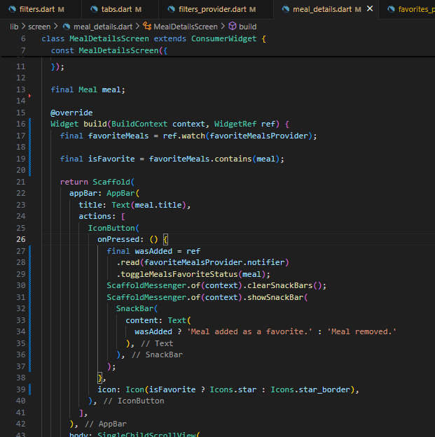     
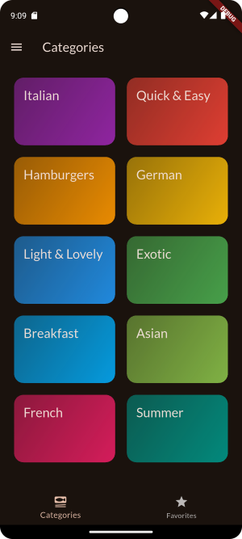
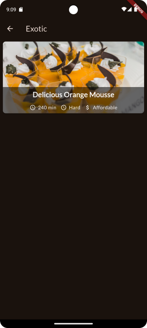
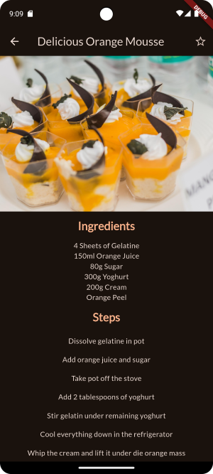
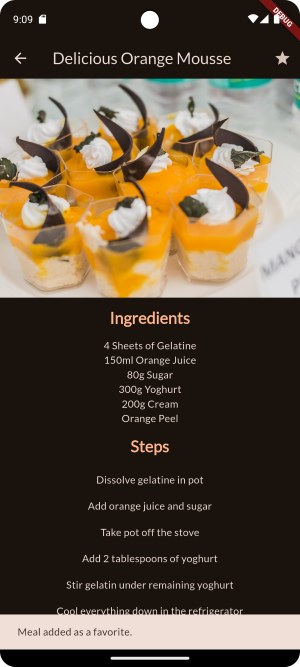
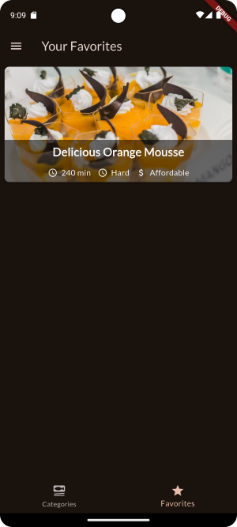