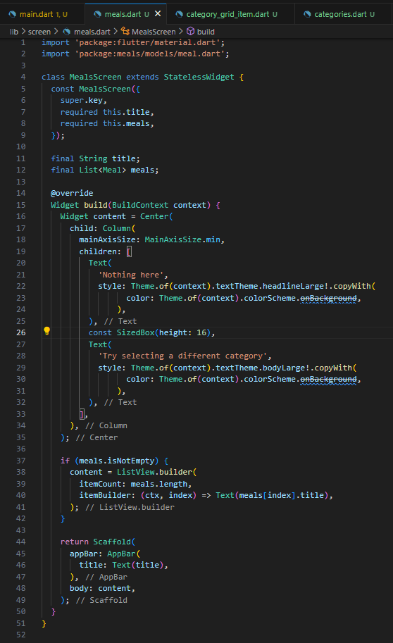
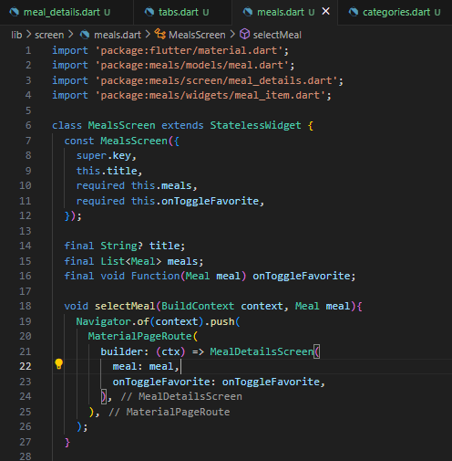
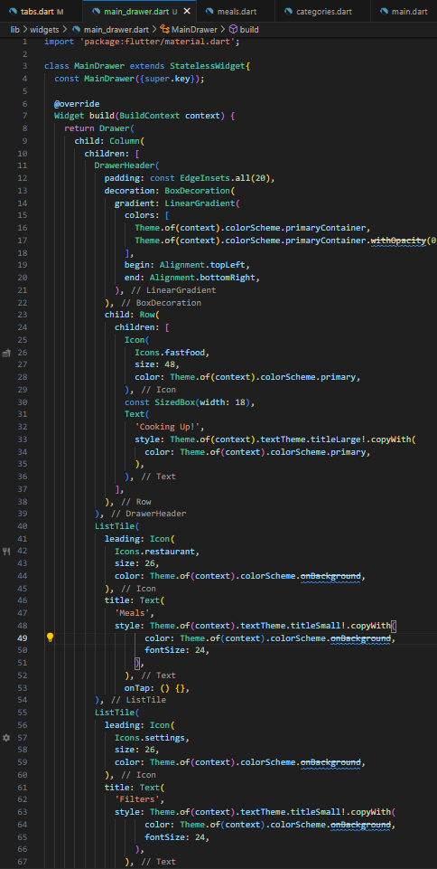

# meals

## Using a GridView
 Ekranın üst kısmında bir başlık (AppBar) bulunur. Gövde kısmında ise 2 sütunlu bir grid yer alır.  
 
   
 

## Displaying Category Items on a Screen
```CategoriesScreen```, kullanıcıya tüm yemek kategorilerini grid şeklinde listeler.   
```availableCategories``` (```dummy_data.dart``` dosyasında) adlı veri listesindeki her bir kategori için bir kutu (```CategoryGridItem```) oluşturur.
Bu kutular, 2 sütunlu bir grid içinde düzenlenmiştir.   
  
Her bir kategori için ayrı bir kutu widget’ı tanımlar.  
   
 

## Making any Widget Tappable with InkWell
Kategori kutusu artık bir ```InkWell``` widget'ı ile sarmalanmıştır. Bu sayede bir kategoriye tıklandğında etkileşimli bir splash efekti görünecek. 

- ```onTap: () {}``` fonksiyonu şu anda boş bırakılmıştır; ileride farklı sayfalara yönlendirme gibi işlemler yapılacak.
- ```splashColor```, temanın ```primaryColor``` değeri ile belirlenmiştir ve tıklama efektinin rengini tanımlar.
- ```borderRadius``` hem ```InkWell``` hem de ```Container``` içinde tanımlanmıştır.

    
 

## Loading Meals Data Into a Screen
Bir kategori seçildiğinde, o kategoriye ait yemeklerin listelendiği yeni bir ekran açılır.
Eğer o kategoriye ait hiç yemek yoksa, kullanıcıya bilgi veren boş bir mesaj gösterilir.  

- ```title```: AppBar’da gösterilecek başlık (kategori adı).
- ```meals```: Liste olarak gösterilecek yemekler (Meal tipinde).  

Eğer meals listesi boşsa, kullanıcıya açıklayıcı bir mesaj gösteriliyor.  
Eğer meals listesi boş değilse, yemek başlıklarını ```ListView.builder``` kullanarak dikey liste halinde gösteriyor.  


    
 

## Adding Cross-Screen Navigation
Bir kategoriye tıklandığında ilgili sayfaya geçiş özelliği eklendi.  
```CategoriesScreen``` dosyasındaki ```_selectCategory``` metodu sayesinde, kullanıcı bir kategoriye tıkladığında ```MealsScreen``` adlı başka bir sayfaya geçiliyor. (Şimdilik örnek başlık ('Some title') ve boş bir liste (meals: []) gönderiliyor.)  

```CategoryGridItem```'a onTap davranışı eklendi. ```CategoryGridItem``` bileşenine, kategoriye tıklanınca çalışacak ```onSelectCategory``` fonksiyonu gönderildi. Bu fonksiyon, ```_selectCategory``` fonksiyonunu çağırıyor ve yeni sayfaya geçiş yapıyor.  

```CategoryGridItem``` artık dışarıdan bir ```onSelectCategory``` fonksiyonu alıyor. Yani bu kutuya tıklanınca hangi işlem yapılacaksa, bu dışarıdan belirlenebiliyor. Ayrıca InkWell'da onTap ile ilişkilendirildi.  Kullanıcı kategori kutusuna tıkladığında ```onSelectCategory``` fonksiyonu çalıştırılıyor.  


   

   

## Passing Data to the Target Screen
Hangi kategoriye tıklandığı _selectCategory fonksiyonuna iletiliyor. Ayrıca seçilen kategoriye göre filtreleme yapılıyor. dummyMeals listesindeki yemekleri, tıklanan kategoriye göre filtreleniyor. Yani sadece o kategoriye ait yemekler MealsScreen'e gönderiliyor.
Artık bir kategoriye tıklandığında o kategoriye ait yemekler görebiliyoruz ama tabii ki stil ayarları henüz yapılmadı.  
   


## Introducing the Stack Widget
Artık kategoriye tıklandığında o kategorideki yemekleri görselleriyle birlikte görebiliyoruz.   
```meal_item.dart``` dosyası eklendi ve yemekler için bir card tasarımı oluşturuldu. 
- ```Card widget```: Görsel çerçeveli, gölgeli bir yapı oluşturur.
- ```InkWell``` ile sarılı: Tıklanabilir hale getirilmiş.
- ```FadeInImage```: Görsel yüklenirken geçiş efektiyle görünür.
- ```placeholder``` olarak saydam bir resim (```transparent_image```) kullanılıyor.
- ```Stack``` ve ```Positioned```: Resmin alt kısmına yazı bindirmek için kullanılmış.
- ```Container``` içinde başlık + bilgi alanı: Siyah yarı saydam arka plan üzerinde başlık gösteriliyor.

```MealsScreen``` sınıfında da artık her yemek sadece başlık olarak Text değil, bir ```MealItem``` kartıyla gösteriliyor.


   


## Improving the MealItem Widget

```MealItemTrait``` adında yeni bir widget eklendi. Tekrarlanan "ikon + yazı" yapısı küçük, yeniden kullanılabilir bir widget’a dönüştürüldü.  
```MealItem```'da da Yemek kartlarının alt kısmına, yemeğe dair ek bilgiler (süre, zorluk, maliyet) eklendi.   

   

    


## Adding Navigation to the MealDetails Screen
MealDetailsScreen oluşturuldu bu sayede bir yemeğe tıklandığında detaylarına yönlendirilebilecek.   
| **Adım** | **Ne Oluyor?**                                                                                                                                                                                                          |
| -------- | ----------------------------------------------------------------------------------------------------------------------------------------------------------------------------------------------------------------------- |
| **1.**   | Kullanıcı, ekranda listelenen yemeklerden birinin **kartına (MealItem)** tıklar. Bu kartın içinde bir `InkWell` vardır ve `onTap` özelliği ayarlanmıştır.                                                               |
| **2.**   | Kartın `onTap`'i tetiklenince, `MealItem` widget'ına dışarıdan parametre olarak gelen **`onSelectMeal(meal)`** fonksiyonu çağrılır. Bu fonksiyona, tıklanan yemeği temsil eden `meal` nesnesi parametre olarak verilir. |
| **3.**   | `onSelectMeal` fonksiyonu, aslında `MealsScreen` içinde tanımlanmıştır ve içinde `Navigator.of(context).push(...)` kodu vardır. Bu sayede **yeni bir ekran (MealDetailsScreen)** açılır.                                |
| **4.**   | Açılan detay ekranına (`MealDetailsScreen`) **tıklanan yemek (`meal`) bilgisi gönderilir**. 

  

    


## Improving the MealDetails Screen

- `SingleChildScrollView` eklendi. Bu sayede içerik ekran boyutunu aşarsa, kullanıcı sayfayı kaydırabilir.                    
- `meal.ingredients` listesindeki her bir madde `Text` olarak ekranda gösteriliyor.                                       
- `meal.steps` listesindeki her bir pişirme adımı yine `Text` ve `Padding` ile listeleniyor.                     
- `Image.network` özelliği genişlik ve yükseklik ile düzenlenmiş, `BoxFit.cover` sayesinde görsel düzgün şekilde kırpılıyor.                                     

    


## Adding Tab-based Navigation
TabsScreen eklendi: 
- Altta iki sekmeli bir gezinme çubuğu eklendi: **Categories** ve **Favorites**                                  
- Kullanıcının hangi sekmede olduğunu takip etmek için `_selectedPageIndex` değişkeni ve `setState` kullanıldı. 
- `CategoriesScreen` ve `MealsScreen` arasında geçiş yapılabiliyor.                                              
- AppBar başlığı seçilen sekmeye göre değişiyor.                                                                 


  


## Passing Functions Through Multiple Layers of Widgets (for State Management)
Kullanıcı bir yemeğin detay ekranında star ikonuna tıklayarak favorilere ekleyebiliyor veya çıkarabiliyor.

- `_toggleMealFavoriteStatus(Meal meal)`:  Favori ekleme/çıkarma işlemini yönetiyor.                     
- `_showInfoMessage(String message)`:     Kullanıcıya işlem sonucu mesaj gösteriyor.                    |
- `_favoriteMeals`:                        Favorilere eklenen yemeklerin tutulduğu liste (state içinde). |

`onToggleFavorite` fonksiyonu: `TabsScreen`'den → `CategoriesScreen` → `MealsScreen` → `MealDetailsScreen` bileşenlerine parametre olarak geçiriliyor. Böylece her ekrandan favori işlemi tetiklenebilir hale geldi.

- `CategoriesScreen`:   Kategoriye tıklanınca `MealsScreen`'e `onToggleFavorite` da gönderiliyor.         
- `MealsScreen`:        Liste elemanına tıklanınca `MealDetailsScreen`'e `onToggleFavorite` gönderiliyor. 
- `MealDetailsScreen`:  AppBar'daki yıldız ikonuna tıklanınca favori durumu değiştiriliyor.               

     


    


## Adding a Side Drawer
MainDrawer widget’ı ile uygulamaya yan menü (Drawer) işlevi kazandırıldı.




## Closing the Drawer Manually
Yan menüde açılan meals kategorisine tıklandığında yan menü kapanıyor.


## Adding a Filter Item
`FiltersScreen` adında yeni bir ekran oluşturuldu. Bu ekran sayesinde kullanıcılar kendi tercihlerine göre yemekleri filtreleyebilecek. Şu an sadece gluten-free filtresi eklendi.


## Replacing Screens (Instead of Pushing)
MainDrawer içinde bir onSelectCategory fonksiyonu hangi menü seçildiğini yukarıya (Scaffold’a) bildiriyor. "meals" seçildiğinde TabsScreen’e dönüyor.


   


## Returning Data When Leaving a Screen
WillPopScope, kullanıcı geri tuşuna bastığında özel bir işlem yapmasını sağlıyor. Normalde geri tuşuna basınca direkt sayfa kapanıyordu ama burada filtre bilgileri bir Map olarak geri gönderiliyor.


## Reading & Using Returned Data
TabsScreen’e filtre ekranını Drawer’dan açma ve oradan seçilen filtre ayarlarını (Map<Filter, bool>) geri alma özelliği eklendi.
Şu an bu veriler sadece print ile konsola yazdırılıyor, ileride yemek listelerini filtrelemek için kullanılabilecek.


## Applying Filters
Filtreleme özelliği eklendi. kInitialFilters ile başlangıç filtre değerleri tanımlandı (glutenFree, lactoseFree, vegetarian, vegan).
Seçilen filtreler Map<Filter, bool> _selectedFilters içinde tutuluyor.   

Drawer’dan "filters" seçildiğinde FiltersScreen açılıyor ve mevcut filtre değerleri gönderiliyor (currentFilters).
Kullanıcı geri döndüğünde seçilen filtreler Navigator.pop ile TabsScreen’e geri geliyor ve _selectedFilters güncelleniyor.   

availableMeals listesi, _selectedFilters’e göre dummyMeals üzerinden filtreleniyor.
Böylece CategoriesScreen’e sadece seçilen filtrelere uygun yemekler gönderiliyor.    


    


